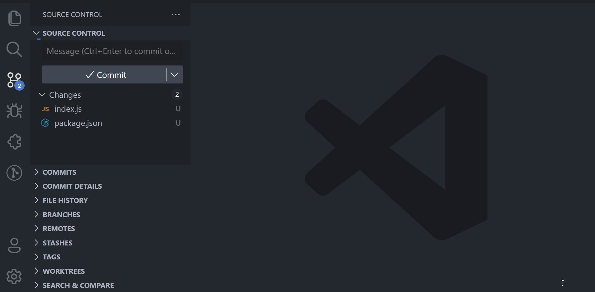

# Spilot: AI assistant for VS Code 

**Spilot is an AI assistant** for Visual Studio Code that helps you write code faster and more efficiently. With Spilot, you can ask questions about your code, get explanations for complex concepts, and generate code snippets based on your input.

## Features

- Spilot Chat
- Spilot Chat shortcuts commands: Explain code, Fix code, Docs generator & Test generator
- Set API Key: Set your API key for Spilot.
- Remove API Key: Remove your API key for Spilot.
- AI Commits: Use AI to commit your code changes.

## Requirements

- Visual Studio Code version 1.75.0 or higher.

## Installation

1. Open Visual Studio Code.
2. Go to the Extensions view by clicking on the Extensions icon in the Activity Bar on the side of the window or by pressing `Ctrl+Shift+X`.
3. Search for **"Spilot"** in the search bar.
4. Click on the "Install" button for the Spilot extension.
5. Once the installation is complete, you will be prompted to reload Visual Studio Code.

## Usage

To use Spilot, you must first set your API key. To do this, press `Ctrl+Shift+P` to open the Command Palette, and search for "Spilot: Set API Key" in the command palette to set your OpenAI API key (completely safe and secure).

Once your API key is set, you can start using the next features:

## Spilot Chat

- Spilot Chat tool allows you to quickly resolve any doubts related to programming or other topics while working on your code.

## Shortcuts (Explain, Fix, Docs, Test)

- When selecting code and right-clicking on the selection, you can access shortcuts that will help you quickly execute the functionality you need and get a response in your Spilot Chat.

## AI Commits

- To use AI to commit your code, run the "AI Commit" command (under the "Spilot (Git)" category). Spilot will generate a commit message using AI, and you can choose whether to use gitmoji and/or semantic versioning in your commit.

## Configuration

You can configure Spilot by going to File > Preferences > Settings, and searching for "Spilot". Here, you can set the following options:

- API Key: Set your API key and IA provider for Spilot (default: OpenAI).
- Model: The model to use for Spilot.
- Max Tokens: The maximum number of tokens to generate.
- Temperature: The temperature of the model (between 0 and 1).

## License

This extension is licensed under the [MIT License](LICENSE).

**This README was generated by Spilot 🤖**
